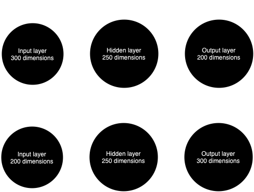
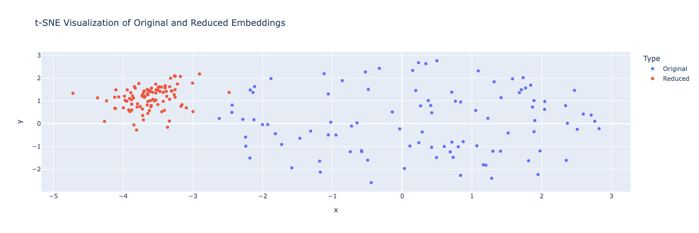

# **Game Recommender**

## Group: Vinicius Eller and Arthur Chieppe

### Usage

To train the embeddings, first install the necessary Python packages by running pip install -r requirements.txt. Then, execute `utils/train_embeddings.py` to train and save both the embeddings and the autoencoder model in the `model/example` directory. Once training is complete, you can use `tsne.ipynb` to visualize the clusters in the embedding space. Additionally, `app/glove_recommender.py` allows you to query the dataset and explore related items within the trained embeddings.

### Step 1: Embeddings

The dataset consists of game reviews scraped from Gamerant. The CSV file contains two columns: the title of the game and the review text. Each row represents a unique game-review pairing, forming the basis for subsequent embedding generation.

An autoencoder architecture generates embeddings. The encoder compresses the input dimension to a 200-dimensional space using two fully connected layers with ReLU activations. The decoder mirrors this structure to reconstruct the original embeddings, and the Adam optimizer adjusts weights with a learning rate of 0.0001.



The training process minimizes the Mean Squared Error (MSE) between the input and the reconstructed embeddings. MSE is preferred over Cross Entropy in this context because it effectively measures the reconstruction error in continuous values. Unlike Cross Entropy, which is designed for classification tasks and emphasizes probability distributions, MSE focuses on the exact numerical differences between input and output. This characteristic allows the model to penalize larger reconstruction errors more heavily, encouraging the autoencoder to refine its representations. The loss function is defined as follows:

$$
\text{MSE} = \frac{1}{n} \sum_{i=1}^n (x_i - \hat{x}_i)^2
$$

### Step 2: visualize your embeddings



The clustering indicates that the reduced embeddings retain significant structural characteristics of the original data. Points in the red cluster are densely packed, suggesting a higher degree of similarity among them. In contrast, the blue cluster shows a more dispersed distribution, implying a broader variety in the original embedding space. This separation between clusters suggests that the reduced embeddings capture core information, though potentially with some loss of detail compared to the original embeddings.

This visualization can help us investigate whether these clusters have any meaningful association with specific themes or concepts in the reviews, such as common topics or vocabulary. 
Analyzing the words from the plot, it's possible to validate a human emotion experince cluster. This validation proves the autoencoder's ability to maintain core data structure in its reduced form. However no further efforts were made to prove that this might be just a coincidence or not.

### Step 3: test the search system

The results across different tests—whether for a racing game, a puzzle game, or a horror-educational game—consistently retrieve the same reviews. This likely occurs because the autoencoder has learned a generalized representation that captures broad, high-level patterns rather than game-specific details. Additionally, the tokenizer processes phrases up to 1000 words, while the queries contain only a few words. This mismatch may dilute the impact of specific query terms, causing the model to rely more on general similarities across reviews than on the unique characteristics of each query.

"A racing game with mercedes cars"
```
[{'title': "'Assassin's Creed: Revelations' Review",
  'link': 'https://gamerant.com/assassins-creed-revelations-reviews/'},
 {'title': "Do Not Play 'Sharknado: The Video Game'",
  'link': 'https://gamerant.com/sharknado-video-game-review/'},
 {'title': "'Xenoblade Chronicles 3D' Review",
  'link': 'https://gamerant.com/xenoblade-chronicles-3d-review/'},
 {'title': 'Eternal Senia Review: Free ARPG Video Game Should Please Casual Genre Fans',
  'link': 'https://gamerant.com/eternal-senia-reviews-327/'},
 {'title': "Review: 'Unium' is a Chill Puzzle Game to Twist Your Brain",
  'link': 'https://gamerant.com/unium-reviews/'},
 {'title': "'Quarrel' Review",
  'link': 'https://gamerant.com/quarrel-reviews/'},
 {'title': 'Gauntlet: Slayer Edition Review',
  'link': 'https://gamerant.com/gauntlet-slayer-edition-reviews-248/'},
 {'title': "Review: 'Dreaming Sarah' Evokes 'Yume Nikki' And Trippy Nostalgia",
  'link': 'https://gamerant.com/dreaming-sarah-reviews/'},
 {'title': "'Dragon Rider' Review: Mobile Dragon Adventure Game Flies High",
  'link': 'https://gamerant.com/dragon-rider-reviews-235/'},
 {'title': "'Thor: God of Thunder' 3DS Review",
  'link': 'https://gamerant.com/thor-god-of-thunder-3ds-reviews/'}]
```

"A puzzle game featuring portal and teleportation mechanics"
```
[{'title': "'Assassin's Creed: Revelations' Review",
  'link': 'https://gamerant.com/assassins-creed-revelations-reviews/'},
 {'title': "Do Not Play 'Sharknado: The Video Game'",
  'link': 'https://gamerant.com/sharknado-video-game-review/'},
 {'title': "Review: 'Unium' is a Chill Puzzle Game to Twist Your Brain",
  'link': 'https://gamerant.com/unium-reviews/'},
 {'title': 'Eternal Senia Review: Free ARPG Video Game Should Please Casual Genre Fans',
  'link': 'https://gamerant.com/eternal-senia-reviews-327/'},
 {'title': "'Xenoblade Chronicles 3D' Review",
  'link': 'https://gamerant.com/xenoblade-chronicles-3d-review/'},
 {'title': "'Quarrel' Review",
  'link': 'https://gamerant.com/quarrel-reviews/'},
 {'title': "Review: 'Dreaming Sarah' Evokes 'Yume Nikki' And Trippy Nostalgia",
  'link': 'https://gamerant.com/dreaming-sarah-reviews/'},
 {'title': 'Gauntlet: Slayer Edition Review',
  'link': 'https://gamerant.com/gauntlet-slayer-edition-reviews-248/'},
 {'title': "'Dragon Rider' Review: Mobile Dragon Adventure Game Flies High",
  'link': 'https://gamerant.com/dragon-rider-reviews-235/'},
 {'title': "'The Walking Dead: Episode 5' Review",
  'link': 'https://gamerant.com/walking-dead-game-episode-5-reviews/'}]
```

"A game that combines elements of horror and educational content"
```
[{'title': "'Assassin's Creed: Revelations' Review",
  'link': 'https://gamerant.com/assassins-creed-revelations-reviews/'},
 {'title': "Do Not Play 'Sharknado: The Video Game'",
  'link': 'https://gamerant.com/sharknado-video-game-review/'},
 {'title': "'Xenoblade Chronicles 3D' Review",
  'link': 'https://gamerant.com/xenoblade-chronicles-3d-review/'},
 {'title': 'Eternal Senia Review: Free ARPG Video Game Should Please Casual Genre Fans',
  'link': 'https://gamerant.com/eternal-senia-reviews-327/'},
 {'title': "Review: 'Unium' is a Chill Puzzle Game to Twist Your Brain",
  'link': 'https://gamerant.com/unium-reviews/'},
 {'title': "'Quarrel' Review",
  'link': 'https://gamerant.com/quarrel-reviews/'},
 {'title': "'Dragon Rider' Review: Mobile Dragon Adventure Game Flies High",
  'link': 'https://gamerant.com/dragon-rider-reviews-235/'},
 {'title': 'Gauntlet: Slayer Edition Review',
  'link': 'https://gamerant.com/gauntlet-slayer-edition-reviews-248/'},
 {'title': 'Review: ‘David’ Game Comes to Steam and Evil Better Watch Out',
  'link': 'https://gamerant.com/david-game-reviews/'},
 {'title': "Review: 'Dreaming Sarah' Evokes 'Yume Nikki' And Trippy Nostalgia",
  'link': 'https://gamerant.com/dreaming-sarah-reviews/'}]
```

